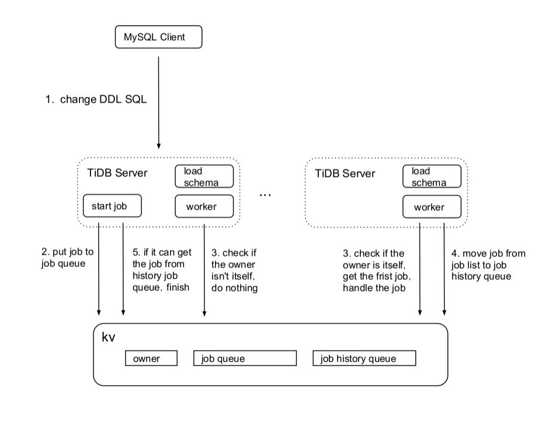
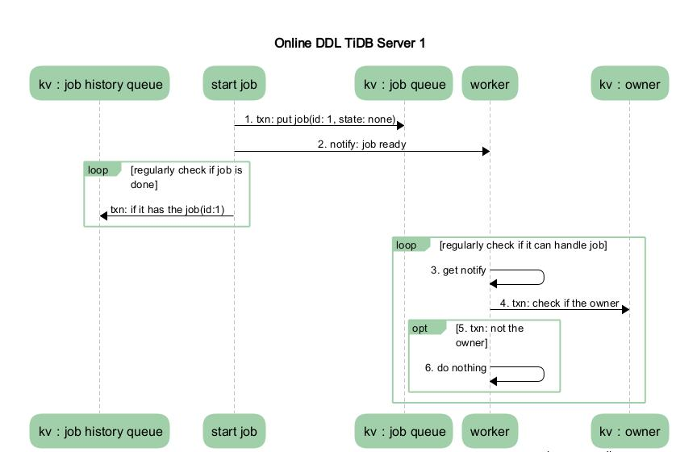
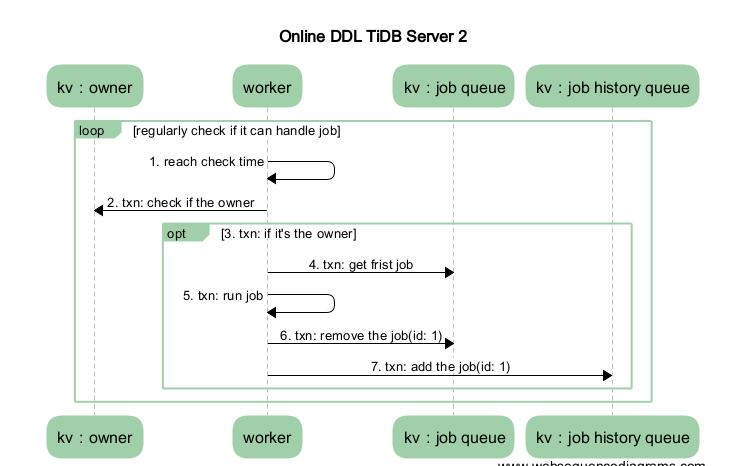
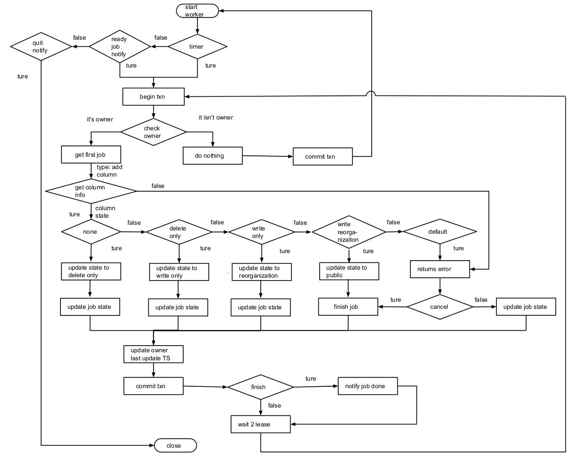

# TiDB 的异步 schema 变更实现

## 背景
  现在一般数据库在进行 DDL 操作时都会锁表，导致线上对此表的 DML 操作全部进入等待状态（有些数据支持读操作，但是也以消耗大量内存为代价），即很多涉及此表的业务都处于阻塞状态，表越大，影响时间越久。这使得 DBA 在做此类操作前要做足准备，然后挑个天时地利人和的时间段执行。为此，架构师们在设计整个系统的时候都会很慎重的考虑表结构，希望将来不用再修改。但是未来的业务需求往往是不可预估的，所以 DDL 操作无法完全避免。由此可见原先的机制处理 DDL 操作是令许多人都头疼的事情。本文将会介绍 TiDB 是如何解决此问题的。

## 解决方案
  根据 Google F1 的在线异步 schema 变更算法实现，并做了一些简单优化。为了简化设计，整个系统同一时刻只允许一个节点做 schema 变更。这里先说明一下，本文不会讲述 Google F1 schema 算法推导过程，对此算法不了解的可以直接阅读[论文原文](http://static.googleusercontent.com/media/research.google.com/zh-CN//pubs/archive/41376.pdf)或者[本书前一章节](schema-change.md)。

## DDL的分类：
由于 bootstrap 操作时需要修改 DDL，这样就产生了鸡生蛋，蛋生鸡的依赖问题。所以需要将 DDL 分成两类，静态 DDL 和动态 DDL。系统 bootstrap 阶段只使用静态 DDL，同时必须在一个事务内完成，而后续所有的操作只允许使用动态 DDL。

## 引入新概念：
*   **元数据记录**：为了简化设计，引入 system database 和 system table 来记录异步 schema 变更的过程中的一些元数据。
*   **State**：根据 F1 的异步 schema 变更过程，中间引入了一些状态，这些状态要和 column，index， table 以及 database 绑定， state 主要包括 none, delete only, write only, write reorganization, public。前面的顺序是在创建操作的时候的，创建操作的状态与它d的顺序相反，write reorganization 改为 delete reorganization，虽然都是 reorganization 状态，但是由于可见级别是有很大区别的，所以将其分为两种状态标记。
*   **Lease**：同一时刻系统所有节点中 schema 最多有两个不同的版本，即最多有两种不同状态。正因为如此，一个租期内每个正常的节点都会自动加载 schema 的信息，如果不能在租期内正常加载，此节点会自动退出整个系统。那么要确保整个系统的所有节点都已经从某个状态更新到下个状态需要 2 倍的租期时间。
*   **Job**： 每个单独的 DDL 操作可看做一个 job。在一个 DDL 操作开始时，会将此操作封装成一个 job 并存放到 job queue，等此操作完成时，会将此 job 从 job queue 删除，并在存入 history job queue，便于查看历史 job。
*   **Worker**：每个节点都有一个 worker 用来处理 job。
*   **Owner**：整个系统只有一个节点的 worker 能当选 owner 角色，每个节点都可能当选这个角色，当选 owner 后 worker 才有处理 job 的权利。owner 这个角色是有任期的，owner 的信息会存储在 KV 层中。worker定期获取 KV 层中的 owner 信息，如果其中 ownerID 为空，或者当前的 owner 超过了任期，则 worker 可以尝试更新 KV 层中的 owner 信息（设置 ownerID 为自身的 workerID），如果更新成功，则该 worker 成为 owner。在租期内这个用来确保整个系统同一时间只有一个节点在处理 schema 变更。
*   **Background operations**：主要用于 delete reorganization 的优化处理，跟前面的 worker 处理 job 机制很像。所以引入了 background job， background job queue， background job history queue， background worker 和 background owner，它们的功能跟上面提到的角色功能一一对应，这里就不作详细介绍。

## 变更流程
  通过上面的章节可以了解异步 schema 变更的基本概念，本章节会将这些基本点串联成具体的变更流程。这里在讲述流程的时候会对 MySQL Client 端， MySQL Protocol 层和 KV 层的操作也会一笔带过，只介绍 TiDB SQL 层中处理异步 schema 变更的流程。
  基本流程如图 1，下面将详细介绍每个模块以及具体流程。


#### 模块
*   **TiDB Server**：包含了 TiDB 的 MySQL Protocol 层和 TiDB SQL 层，图中主要描述的是 TiDB SQL 层中涉及到异步 schema 变更的基本模块。
*   **load schema**：是在每个节点（这个模块跟之前提到的 worker 一样，便于理解可以这样认为）启动时创建的一个 gorountine， 用于在到达每个租期时间后去加载 schema，如果某个节点加载失败 TiDB Server 将会自动挂掉。此处加载失败包括加载超时。
*   **start job**：是在 TiDB SQL 层接收到请求后，给 job 分配 ID 并将之存入 KV 层，之后等待 job 处理完成后返回给上层，汇报处理结果。
*   **worker**：每个节点起一个处理 job 的 goroutine，它会定期检查是否有待处理的 job。 它在得到本节点上 start job 模块通知后，也会直接去检查是否有待执行的 job 。
*   **owner**：可以认为是一个角色，信息存储在 KV 层，其中包括记录当前当选此角色的节点信息。
*   **job queue**：是一个存放 job 的队列，存储在 KV 层，逻辑上整个系统只有一个。
*   **job history queue**：是一个存放已经处理完成的 job 的队列，存储在 KV 层，逻辑上整个系统只有一个。

#### 基本流程
  本小节描述的是异步 DDL 变更的整体流程，忽略实现细节。假设系统中只有两个节点，TiDB Server 1 和 TiDB Server 2。其中 TiDB Server 1 是 DDL 操作的接收节点， TiDB Server 2 是 owner。如下图 2 展示的是在 TiDB Server 1 中涉及的流程，图 3 展示的是在 TiDB Server 2 中涉及的流程。





1.   MySQL Client 发送给 TiDB Server 一个更改 DDL 的 SQL 语句请求。
2.   某个 TiDB Server 收到请求（MySQL Protocol 层收到请求进行解析优化），然后到达 TiDB SQL 层进行执行。这步骤主要是在 TiDB SQL 层接到请求后，会起个 start job 的模块根据请求将其封装成特定的 DDL job，然后将此 job 存储到 KV 层， 并通知自己的  worker 有 job 可以执行。
3.   收到请求的 TiDB Server 的 worker 接收到处理 job 的通知后，判断自身是否处于 owner 的角色，如果处于 owner 角色则直接处理此 job，如果没有处于此角色则退出不做任何处理。图中我们假设没有处于此角色，那么其他的某个 TiDB Server 中肯定有一个处于此角色的，如果那个处于 owner 角色节点的 worker 通过定期检测机制来检查是否有 job 可以被执行时，发现了此 job，那么它就会处理这个 job。
4.   当 worker 处理完 job 后， 它会将此 job 从 KV 层的 job queue 中移除，并放入 job history queue。
5.   之前封装 job 的 start job 模块会定期去 job history queue 查看是否有之前放进去的 job 对应 ID 的 job，如果有则整个 DDL 操作结束。
6.   TiDB Server 将 response 返回 MySQL Client。

#### 详细流程
  本小节以在 Table 中添加 Column 为例详细介绍 worker 处理 job 的整个流程，具体流程如图 4 。考虑到与前面章节的连续性，图 4 可以理解为是图 2 和图 3 的展开描绘。



便于在之后介绍中获取信息的方式，此处贴出了 job 的结构。
```go
	type Job struct {
		ID       int64      `json:"id"`
		Type     ActionType `json:"type"`
		SchemaID int64      `json:"schema_id"`
		TableID  int64      `json:"table_id"`
		State    JobState   `json:"state"`
		Error    string     `json:"err"`
		// every time we meet an error when running job, we will increase it
		ErrorCount int64         `json:"err_count"`
		Args       []interface{} `json:"-"`
		// we must use json raw message for delay parsing special args.
		RawArgs     json.RawMessage `json:"raw_args"`
		SchemaState SchemaState     `json:"schema_state"`
		// snapshot version for this job.
		SnapshotVer uint64 `json:"snapshot_ver"`
		// unix nano seconds
		// TODO: use timestamp allocated by TSO
		LastUpdateTS int64 `json:"last_update_ts"`
	}
```

###### TiDB Server 1 流程
1.   start job 给 start worker 传递了 job 已经准备完成的信号。
2.   worker 开启一个事务，检查自己是否是 owner 角色，结果发现不是 owner 角色（此处跟先前的章节保持一致，假设此节点 worker 不是 owner 角色），则提交事务退出处理 job 的循环，回到 start worker 等待信号的循环。

###### TiDB Server 2 流程
1.   start worker 中的定时器到达时间。
2.   开启一个事务，检查发现本节点为 owner 角色。
3.   从 KV 层获取队列中第一个 job（假设就是 TiDB Server 1 之前放入的 job），判断此 job 的类型并对它做相应的处理。
4.   此处 job 的类型为 add column，然后流程到达图中 get column information 步骤。  
&emsp;&emsp;a.取对应 table info（主要通过 job 中 schemaID 和 tableID 获取），然后确定添加的 column 在原先的表中不存在或者为不可见状态。  
&emsp;&emsp;b.如果新添加的 column 在原先表中不存在，那么将新 column 信息关联到 table info。  
&emsp;&emsp;c.在前面两个步骤中发生某些情况会将此 job 标记为 cancel 状态，并返回 error，到达图中 returns error 流程。比如发现对应的数据库、数据表的状态为不存在或者不可见（即它的状态不为 public），发现此 column 已存在并为可见状态等一些错误，这里就不全部列举了。
5.   schema 版本号加 1。
6.   将 job 的 schema 状态和  table 中 column 状态标记为 delete only， 更新 table info 到 KV 层。
7.   因为 job 状态没有 finish（即 done 或者 cancel 状态），所以直接将 job 在上一步更新的信息写入 KV 层。
8.   在执行前面的操作时消耗了一定的时间，所以这里将更新 owner 的 last update timestamp 为当前时间（防止经常将 owner 角色在不同服务器中切换），并提交事务。
9.   循环执行步骤 2、 3、 4.a、5、 6、 7 、8，不过将6中的状态由 delete only 改为 write only。
10.   循环执行步骤 2、 3、 4.a、5、 6、 7 、8，不过将6中的状态由 write only 改为 write  reorganization。
11.   循环执行步骤 2、 3、 4.a、5，获取当前事务的快照版本，然后给新添加的列填写数据。通过应版本下需要得到的表的所有 handle（相当于 rowID），出于内存和性能的综合考量，此处处理为批量获取。然后针对每行新添加的列做数据填充，具体操作如下（下面的操作都会在一个事务中完成）：  
&emsp;&emsp;a.用先前取到的 handle 确定对应行存在，如果不存在则不对此行做任何操作。  
&emsp;&emsp;b.如果存在，通过 handle 和 新添加的 columnID 拼成的 key 获取对应列。获取的值不为空则不对此行做任何操作。  
&emsp;&emsp;c.如果值为空，则通过对应的新添加行的信息获取默认值，并存储到 KV 层。  
&emsp;&emsp;d.将当前的 handle 信息存储到当前 job reorganization handle 字段，并存储到 KV 层。假如 12 这个步骤执行到一半，由于某些原因要重新执行 write reorganization 状态的操作，那么可以直接从这个 handle 开始操作。
12.   将调整 table info 中 column 和 index column 中的位置，将 job 的 schema 和 table info 中新添加的 column 的状态设置为设置为public， 更新 table info 到 KV 层。最后将 job 的状态改为 done。
13.   因为 job 状态已经 finish，将此 job 从 job queue 中移除并放入 job history queue 中。
14.   执行步骤8，与之前的步骤一样 12， 13， 14 和 15 在一个事务中。

###### TiDB Server 1 流程
1.   start job 的定时检查触发后，会检查 job history queue 是否有之前自己放入 job queue 中的 job（通过 jobID）。如果有则此 DDL 操作在 TiDB SQL 完成，上抛到 MySQL Protocol 层，最后返回给 Client， 结束这个操作。  
#### 优化
对删除数据库，删除数据表等减少一个状态，即 2 倍 lease 的等待时间，以及删除数据库或者数据表中大量数据所消耗的时间。原本对于删除操作的状态变化是 public -> write only -> delete only -> delete reorganization -> none，优化的处理是去掉 delete reorganization 状态，并把此状态需要处理的元数据的操作放到 delete only 状态时，把具体删除数据的操作放到后台处理，然后直接把状态标为 none。  
这相对原来设计的主要有两点不同，下面介绍下做如此优化是否对数据完整性和一致性有影响。  
*   将删除具体数据这个操作异步处理了。因为在把数据放到后台删除前，此数据表（假设这里执行的是删除表操作，后面提到也这么假设）的元数据已经删除，对外已经不能访问到此表了，那么对于它们下面的具体数据就更不能访问了。这里可能有人会有疑问那异步删除模块是怎么访问的具体数据的，将元数据事先存在 job 信息中，就这么简单。只要保证先删除元数据（保证此事务提交成功）再异步删除具体数据是不会有问题的。
*   去掉了 delete reorganization 状态。本来 delete only 以及之前的状态都没做修改所以必然是没问题的，那么就是考虑 none 这个状态，即当整个系统由于接到变更信息先后不同处于 delete only 以及 none 这两个状态。那么就分析在这个状态下有客户端希望对此表进行一些操作。  
 *   客户端访问表处于 none 状态的 TiDB Server。这个其实更没有做优化前是一致的，即访问不到此表，这边不过多解释。  
 *   客户端访问表处于 delete only 状态的 TiDB Server。此时客户端对此表做读写操作会失败，因为 delete only 状态对它们都不可见。

###### 实现
  此优化对于原先的代码逻辑基本没有变化，除了对于删除操作（目前还只是删除数据库和表操作）在其处于 delete only 状态时，就会把元数据删除，而对起表中具体数据的删除则推迟到后台运行，然后结束 DDL job。放到后台运行的任务的流程跟之前处理任务的流程类似，详细过程如下：

1.   在图 4 中判定 finish 操作为 true 后，判断如果是可以放在后台运行（暂时还只是删除数据库和表的任务），那么将其封装成 background job 放入 background job queue， 并通知本机后台的 worker 将其处理。
2.   后台 job 也有对应的 owner，假设本机的 backgroundworker 就是 background owner 角色，那么他将从 background job queue 中取出第一个 background job， 然后执行对应类型的操作（删除表中具体的数据）。
如果执行完成，那么从 background job queue 中将此 job 删除，并放入 background job history queue 中。
注意步骤2和步骤 3需要在一个事务中执行。

## 总结
  以上内容是 TiDB 的异步 schema 变更实现的基本内容介绍，可能有些流程细节没有讲解清晰，如果对本人的描述或者对实现有疑问的欢迎到 [issues](https://github.com/pingcap/tidb/issues) 讨论。
