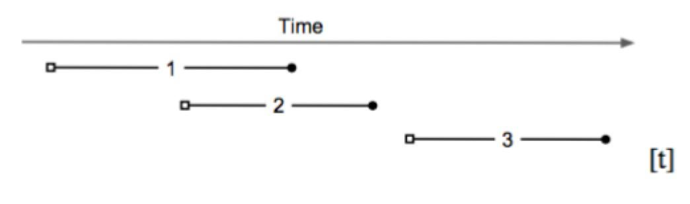
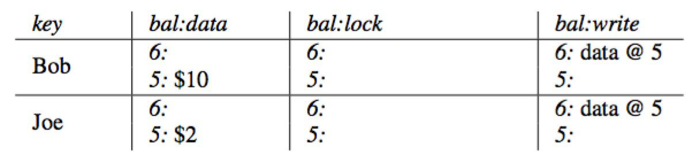
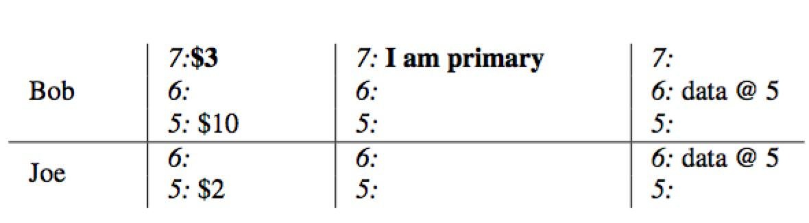
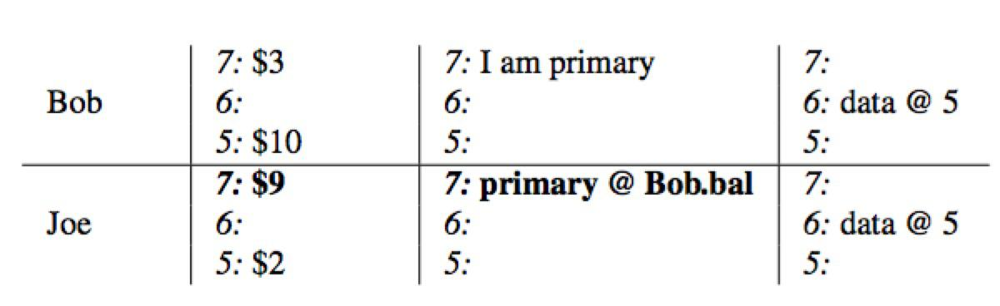
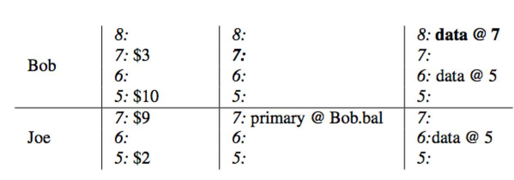
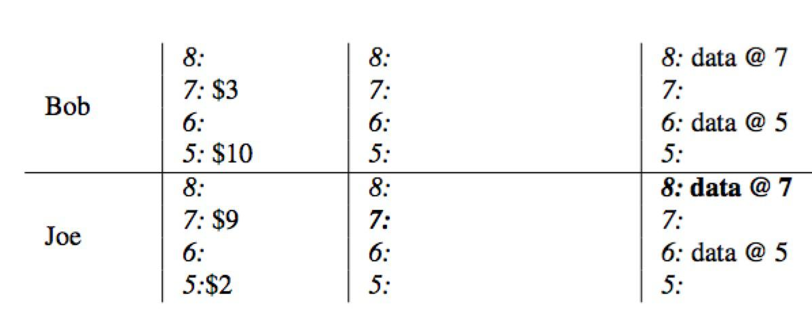
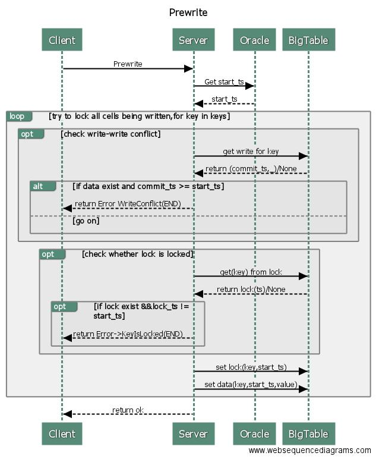
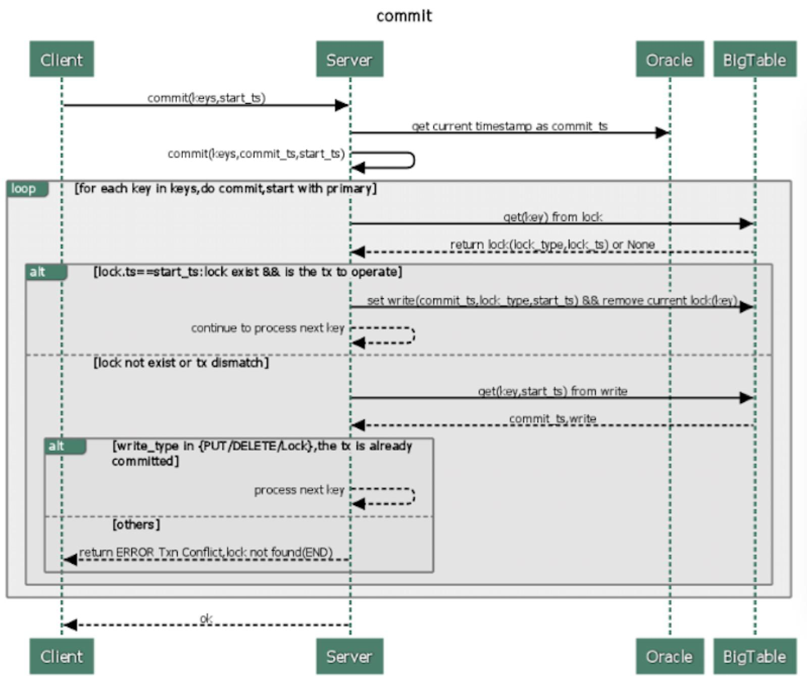
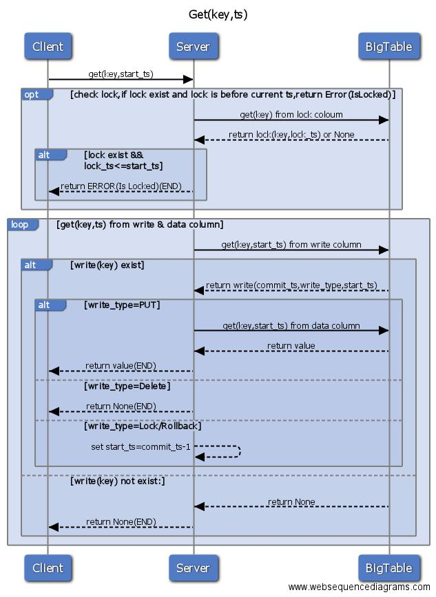
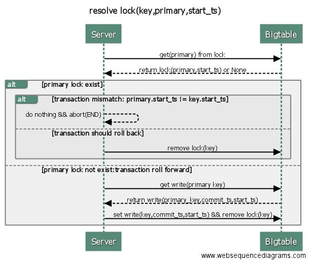

# Google Percolator 的事务模型
 
[参考论文](https://www.usenix.org/legacy/event/osdi10/tech/full_papers/Peng.pdf)
		
##  Percolator 简介

Percolator是由Google公司开发的、为大数据集群进行增量处理更新的系统，主要用于google网页搜索索引服务。使用基于Percolator的增量处理系统代替原有的批处理索引系统后，Google在处理同样数据量的文档时，将文档的平均搜索延时降低了50%。

Percolator的特点如下

* 为增量处理定制
* 处理结果强一致
* 针对大数据量（小数据量用传统的数据库即可）

Percolator为可扩展的增量处理提供了两个主要抽象：

* 基于随机存取库的ACID事务
* 观察者(observers)--一种用于处理增量计算的方式

## 事务

Percolator 提供了跨行、跨表的、基于快照隔离的ACID事务。

### Snapshop isolation

Percolator 使用Bigtable的时间戳记维度实现了数据的多版本化。多版本化保证了快照隔离`snapshot isolation`级别，优点如下：

* 对读操作：使得每个读操作都能够从一个带时间戳的稳定快照获取。
* 对写操作，能很好的应对写写冲突：若事务A和B并发去写一个同一个元素，最多只有一个会提交成功。

如图，基于快照隔离的事务，开始于一个开始时间戳`a start timestamp`（图内为小空格），结束于一个提交时间戳`a commit timestamp`（图内为小黑球）。本例包含以下信息：

* 由于`Transaction 2`的开始时间戳`start timestamp`小于`Transaction 1`的提交时间戳`commit timestamp`，所以`Transaction 2` 不能看到 `Transaction 1` 的提交信息。
* `Transaction 3` 可以看到`Transaction 2` 和 `Transaction 1` 的提交信息。
* `Transaction 1` 和 `Transaction 2` 并发执行：如果它们对同一项进行写入，至少有一个会失败。

#### Lock

Percolator 的请求会直接反映到对Bigtable的修改上，由于Bigtable没有提供便捷的冲突解决和锁管理，所以Percolator需要独立实现一套锁管理机制。锁的管理必须满足以下条件：

* 能直面机器故障：若一个锁在两阶段提交时消失，系统可能将两个有冲突的事务都提交。
* 高吞吐量：上千台机器会同时请求获取锁。
* 低延时：每个`Get()`操作都需要读取一次锁

故其锁服务在实现时，需要做到：

* 多副本 ==> 应对故障
* distributed&balance ==> handle load
* 写入持久化存储系统

BigTable能够满足以上所有要求。所以Percolator在实现时，将实际的数据存于Bigtable中。

### Columns in Bigtable

Percolator在BigTable上抽象了五个`Columns`，其中三个跟事务相关，其定义如下

#### Lock

事务产生的锁，未提交的事务会写本项，会包含`primary lock`的位置。其映射关系为

${key,start_ts}=>${primary_key,lock_type,..etc}

* ${key} 数据的key
* ${start_ts} 事务开始时间
* ${primary} 该事务的`primary`的引用. `primary`是在事务执行时，从待修改的`keys`中选择一个作为`primary`,其余的则作为`secondary`.

#### Write

已提交的数据信息，存储数据所对应的时间戳。其映射关系为

${key,commit_ts}=>${start_ts}

* ${key} 数据的key
* ${commit_ts} 事务的提交时间
* ${start_ts} 该事务的开始时间,指向该数据在`data`中的实际存储位置。

#### Data

具体存储数据集，映射关系为

${key,start_ts} => ${value}

* ${key} 真实的key
* ${start_ts} 对应事务的开始时间
* ${value} 真实的数据值

### 案例

银行转账，Bob 向 Joe 转账7元。该事务于`start timestamp =7` 开始，`commit timestamp=8` 结束。具体过程如下：

1. 初始状态下，Joe的帐户下有10（首先查询`column write`获取最新时间戳数据,获取到`data@5`,然后从`column data`里面获取时间戳为`5`的数据，即`$10`），Bob的帐户下有2。
2. 转账开始，使用`stat timestamp=7`作为当前事务的开始时间戳，将Bob选为本事务的`primary`，通过写入`Column Lock`锁定Bob的帐户，同时将数据`7:$3`写入到`Column,data`列。
3. 同样的，使用`stat timestamp=7`，锁定Joe的帐户，并将Joe改变后的余额写入到`Column,data`,当前锁作为`secondary`并存储一个指向`primary`的引用（当失败时，能够快速定位到`primary`锁，并根据其状态异步清理）
4. 事务带着当前时间戳`commit timestamp=8`进入commit阶段：删除primary所在的lock，并在write列中写入从提交时间戳指向数据存储的一个指针`commit_ts=>data @7`。至此，读请求过来时将看到Bob的余额为3。 
5. 依次在`secondary`项中写入`wirte`并清理锁，整个事务提交结束。在本例中，只有一个`secondary:Joe.`

## 事务处理流程

### Prewrite

Prewrite是事务两阶段提交的第一步，其从Oracle获取代表当前物理时间的全局唯一时间戳作为当前事务的start_ts，尝试对所有被写的元素加锁(为应对客户端故障，pecolactor为所有需要写的key选出一个作为`primary`,其余的作为`secondary`.)，将实际数据存入Bigtable。其中每个key的处理过程如下，中间出现失败，则整个`prewrite`失败：

1. 检查`write-write`冲突：从`BigTable`的write列中获取当前`key`的最新数据，若其`commit_ts`大于等于`start_ts`,说明存在更新版本的已提交事务，返回`WriteConflict`错误，结束。
2. 检查`key`是否已被锁上，如果`key`的锁已存在，返回`KeyIsLock`的错误，结束
5. 往BigTable的`lock`列写入`lock(start_ts,key,primary)`为当前key加锁,若当前key被选为`primary`,则标记为`primary`,若为`secondary`,则标明指向`primary`的信息
6. 往BigTable的`data`列写入的数据`data(key,start_ts,value)`。

### Commit 

 
 `Prewrite`成功后，该事务可能会被提交从而进入第二阶段－－`Commit`
 同样的，在事务提交的开始阶段，将从Oracle获取时间戳作为`commit_ts`代表事务的真正提交时间。然后，将依次对各个key进行提交（第一个为parimary），释放锁，打上提交标识。每个key的提交过程具体如下：
 
 1. 从Bigtable获取key的lock,检查其合法性，若非法，则返回失败
 2. 将`commit_ts`,当前数据在`data`列中的位置,等其它相关信息写入`write`列。
 3. 将当前key所在的`lock` 从 Bigtable的`lock`列删除，至此，该key的锁被释放。
 
 `write` 记录着key的提交记录，当客户端读取一个`key`时，会从write表中读取`key`所对应数据在`data`列中的存储位置，然后从`data`列中读取真正的数据。同时，一旦`primary` 被提交成功后，整个事务对外就算提交成功了。
 
 
 ### Get
 
 
 
 1. `Get` 操作首先检查[0,start_ts]时间区间内`Lock`是否存在，若存在，则返回错误
 2. 如果不存在有冲突的`Lock`,则获取在write中合法的最新提交记录指向的在data中的位置
 3. 根据步骤2获取的内容，从`data`中获取到相应的数据并返回。

 
 ### 异常处理（异步清理锁）
 
 若客户端在`Commit`一个事务时，出现了异常，`Prepare` 时产生的锁会被留下。为避免将新事务`hang`住，Percolator必须清理这些锁。
 
  Percolator用`lazy`方式处理这些锁：当事务A在执行时，发现事务B造成的锁冲突，事务A将决定事务B是否失败，以及清理事务B的那些锁。
  对事务A而言，能准确地判断事务B是否成功是关键。Percolator为每个事务设计了一个元素`cell`作为事务是否成功的同步标准，该元素产生的`lock`即为`primary lock`。A和B事务都能确定事务B的`primary lock`（因为这个`priarmy lock`被写入了B事务其它所有涉及元素的`lock`里面）。执行一个清理`clean up`或者提交`commit`操作需要修改该`primary lock`，由于这些修改是基于Bigtable去做，所以只有一个清理或提交会成功。注意：
  
  * 在B提交`commit`之前,它会先确保其`primary lock`被`write record`所替代（即往`primary`的`write`写提交数据，并删除对应的`lock`）。
  * 在A清理B的锁之前，A必须检查B的`primary`以确保B未被提交，如果B的`primary`存在，则B的锁可以被安全的清理掉。

  

  当客户端在执行两阶段提交的`commit`阶段失败时，事务依旧会留下一个提交点`commit point`(至少一条记录会被写入`write`中)，但可能会留下一些`lock`未被处理掉。一个事务能够从其`primary lock`中获取到执行情况：
  
   * 如果`priarmy lock` 已被`write`所替代，也就是说该事务已被提交，事务需要`roll forword`,也就是对所有涉及到的、未完成提交的数据，用`write`记录替代标准的锁`standed lock`。
   * 如果`primary lock`存在，事务被`roll back`(因为我们总是最先提交`primary`,所以`primary`未被提交时，可以安全地执行回滚)
 
 
 
 
 
 

